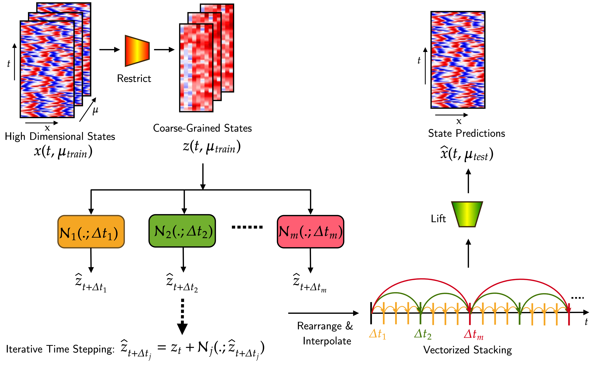

#### Latent Hierarchical Time stepping (L-HiTS) Scheme
This code was used to simulate the results in manuscript titled "**Enhancing Computational Efficiency in Multiscale Systems using
Deep Learning of Coordinates and Flow Maps**"
##

#### Data
Create a "Data" folder. Add two subfolders "FHN" and "KS". To download the data, the links are given below;
####
[FHN](https://drive.google.com/drive/folders/1qVFnnF6S-f0aAB8IztOU2LctSFAAmsyj?usp=drive_link)
####
[KS](https://drive.google.com/drive/folders/1SoIKpadDETtKOLtBs9qdc_RkTPBIj5K_?usp=drive_link)
####

#### Getting Started
#
clone the entire directory
#
git clone https://github.com/erasifhamid/L-HiTS.git
#
conda create -n <ENV_NAME> python=3.7
#
conda activate <ENV_NAME>
#
conda install pytorch torchvision -c pytorch
#
### Training
Train models for all benchmark systems via script "scritps/model_training.ipynb"
#
Save models in "models" folder (Automatically saved on running "model_training" file)
#
Run "latentTestAE.ipynb"  to test on various latent dimensions 
#
Run ""LhitsvsZ_plot.ipynb"" to obtain the sensitivity analysis plot
#
Run "AEHITSplotting.ipynb" to reproduce main figures of KS and FHN.
#
You need to change the system to "FHN" or "KS" to obtain the results of "FHN" or "KS" 

# For any technical issues please contact on erasifhamid@gmail.com
